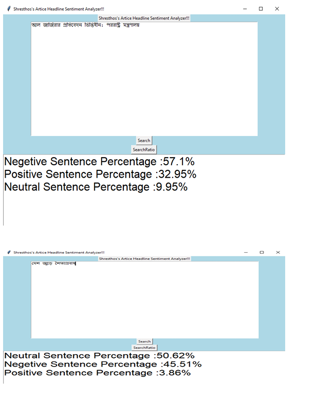
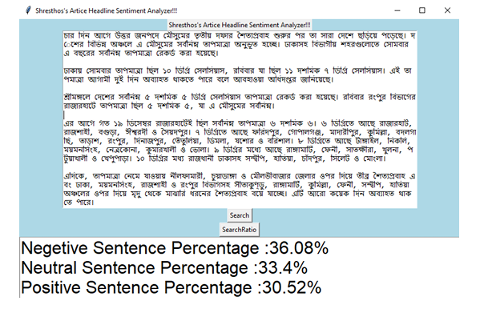

# Bangla-Headline-Sentiment-Analysis
# 📊 Bangla News Article Headline Sentiment Analysis

This project performs sentiment analysis on Bangla news article headlines using TF-IDF feature extraction and traditional machine learning classifiers like SVM and k-NN. We created a labeled dataset from **The Daily Ittefaq**, one of the most popular Bangla newspapers, and achieved promising results with classic ML models.

---

## 📄 Abstract

Automated Bangla article sentiment classification identifies the underlying sentiment of Bangla text data. While there are rich datasets for many languages, Bangla has limited resources. In this project, we curated over **70,000 articles** from *The Daily Ittefaq*, of which **1,000 headlines** were manually labeled for sentiment classification.

Despite the small labeled set, we achieved **82% accuracy with SVM** using TF-IDF features.

---

## 🗃️ Dataset

- **Source:** [The Daily Ittefaq](https://ittefaq.com.bd/)
- **Total Articles Collected:** 53,571
- **Labeled Headlines for Sentiment:** 1,000
- **Corpus Summary:**
  - 📝 Total Unigrams: 13.3M (Unique: 252,073)
  - 📝 Total Bigrams: 13.6M (Unique: 3.7M)
  - 📝 Total Trigrams: 24M (Unique: 8.2M)

### 🔖 Category Breakdown (22 total):
| English            | Count | Bengali          |
|--------------------|-------|------------------|
| National           | 5515  | জাতীয়            |
| World News         | 9052  | আন্তজজাতিক       |
| Whole Country      | 18472 | সারাদেশ          |
| COVID-19 Update    | 2728  | কোভিড-১৯          |
| Capital            | 3533  | রাজধানী          |
| Sports             | 3237  | খেলা             |
| Entertainment      | 2387  | বিনোদন           |
| Politics           | 2174  | রাজনীতি          |
| Court              | 1307  | আদালত            |
| Economy            | 1004  | অর্থনীতি         |
| Education          | 1634  | শিক্ষা            |
| Abroad             | 787   | বিদেশ             |
| Science & Tech     | 772   | বিজ্ঞান ও প্রযুক্তি|
| Culture            | 58    | সংস্কৃতি          |
| Lifestyle          | 165   | জীবনযাপন          |
| Book Fair          | 78    | বইমেলা            |
| Cricket WC 2019    | 620   | ক্রিকেট বিশ্বকাপ - ২০১৯ |

---

## 🧪 Methodology

### 🔍 Preprocessing Steps
1. **Punctuation Removal**  
2. **Unicode and Noise Cleaning**
3. **Duplicate Sentence Removal**
4. **Stop Words Removal** (e.g., "ও", "এবং", "আর")
5. **Stemming** (e.g., লহর, লহদের → লহর)
6. **Tokenization**
7. **Short Document Filtering**

### 📈 Feature Extraction
- **TF-IDF Vectorization**  
  TF-IDF (Term Frequency - Inverse Document Frequency) scores are computed for each word in the headline dataset and used as input features.

### 🤖 Classification Models
- **Support Vector Machine (SVM)** — ✅ **Accuracy: 82%**
- **k-Nearest Neighbors (k-NN)** — ✅ **Accuracy: 76%**

---

